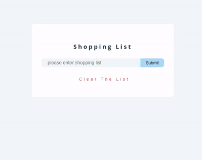
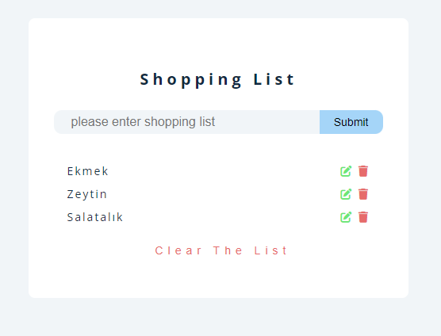

# ShoppingListPRo

<h1> Crud Application  Js Project</h1>

<h2>Content</h2>

<h3>This is a Crud application.An application designed to create a shopping list.It is all created from dynamic js structure.
You can add, remove and edit any product you want.
you can also remove and rearrange all products in the entire list.
On the other hand, local storage is used to record the products you added.

</h3>

<h2>Used technologies</h2>

<h3>
*** HTML5 And CCS were used *** 
***made dynamic with javaScript***  

</h3>

<h2>video gif</h2>

<h2>screenshot</h2>

